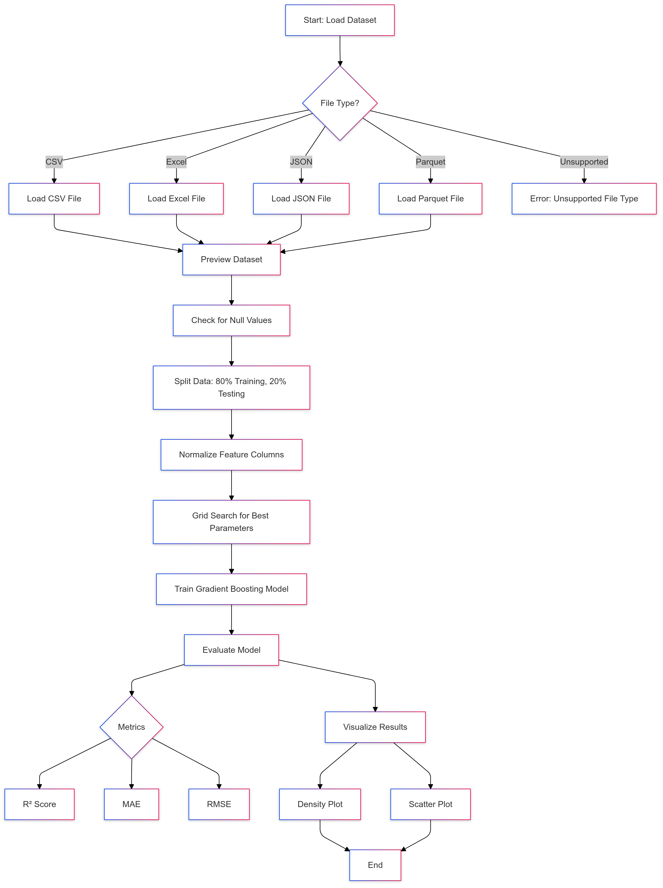

---

# Gradient Boosting Tree Model

---

## Authors

| Name                       | Student ID  | Contribution Files                                   | Contribution % |
|----------------------------|-------------|----------------------------------------------------|----------------|
| Sankar Ganesh Paramasivam  | A20553053   | `test_gradientboost.py`, `GradientBoost.py`        | 25%            |
| Neelarapu Tejaswini        | A20592053   | `checker.py`, `GradientBoost.py`                  | 25%            |
| Vijaya Sai Dasari          | A20540356   | `test_gradientboost.py`, `GradientBoost.py`        | 25%            |
| Aravinth Ananth            | A20537468   | `gridsearch.py`, `GradientBoost.py`               | 25%            |

---
---
## Team Name: THALA
---
## Hosted Streamlit App

You can interact with the project live using the hosted Streamlit app:

👉 **[Gradient Boosting Model App](https://mlprojectaravinthgreat.streamlit.app/)**

---

### **Note for Rapid Output**

To reduce execution time in the Streamlit app, select fewer hyperparameter options during grid search. This will allow you to see rapid outputs while exploring the model's functionality. For example:
- Limit `n_estimators` to [10, 50].
- Use a smaller range for `learning_rate` such as [0.1].
- Limit `max_depth` to [2, 3].

This ensures faster performance without sacrificing functionality.

---

## Project Overview

This project implements a **Gradient Boosting Tree model**. Gradient Boosting is an advanced ensemble learning technique that builds multiple decision trees sequentially, with each tree correcting the errors of its predecessor. This iterative improvement ensures high accuracy and excellent performance on complex datasets.

### Key Features:
- **Custom Implementation**:
  - Implements Gradient Boosting from scratch.
  - Does not rely on prebuilt machine learning libraries for the core model.
- **Hyperparameter Optimization**:
  - Includes grid search to tune hyperparameters (`n_estimators`, `learning_rate`, and `max_depth`).
- **Performance Evaluation**:
  - Supports R² Score, Mean Absolute Error (MAE), and Root Mean Squared Error (RMSE).
- **Visualization**:
  - Provides detailed visual comparisons between actual and predicted values.

---

## Questions and Answers

### **Q1. What does the model do, and when should it be used?**

The **Gradient Boosting Tree model**:
- Combines the predictive power of multiple decision trees to reduce error iteratively.
- Handles non-linear relationships and feature interactions effectively.

**Use cases**:
- Predicting housing prices based on features like location, size, and amenities.
- Estimating demand in time-series data.
- Financial modeling, such as credit scoring or risk assessment.

---

### **Q2. How did you test the model?**

The model was rigorously tested using:
1. **Synthetic Data**:
   - Ensured correctness by generating synthetic datasets and comparing model predictions to expected results.
2. **Hyperparameter Tuning**:
   - Performed grid search across combinations of `n_estimators`, `learning_rate`, and `max_depth` to identify the best parameters.
3. **Metrics**:
   - Evaluated the model using R² Score, MAE, and RMSE to assess accuracy and robustness.
4. **Visualization**:
   - Plotted density and scatter plots to validate how closely predicted values align with actual values.

---

### **Q3. What parameters can users tune to improve performance?**

Users can optimize the following hyperparameters:
- **n_estimators**: Controls the number of boosting iterations (trees). Larger values improve accuracy but increase training time.
- **learning_rate**: Determines the contribution of each tree. Lower values lead to better generalization but require more iterations.
- **max_depth**: Limits the depth of individual trees, balancing model complexity and overfitting.

**Example Grid Search**:
```python
n_estimators_values = [10, 50, 100]
learning_rate_values = [0.1, 0.01]
max_depth_values = [2, 3, 5]

best_params, best_score = grid_search_gradient_boosting(
    X_train, y_train, X_test, y_test, n_estimators_values, learning_rate_values, max_depth_values
)
print("Best Parameters:", best_params)
```

---

### **Q4. Are there specific inputs the model has trouble with?**

The model has the following limitations:
1. **Categorical Data**: 
   - The current implementation does not handle categorical data effectively. Categorical features must be preprocessed (e.g., using one-hot or label encoding) before using the model. Without preprocessing, the model will fail to interpret non-numerical inputs.
2. **Sparse Features**: 
   - If the dataset contains many zero or irrelevant features, performance may degrade.
3. **High Dimensionality**: 
   - Large feature sets can significantly increase computational time.
4. **Imbalanced Data**: 
   - The model may overfit minority class samples without proper handling.

**Potential Solutions**:
- Extend the implementation to natively support categorical data by including automatic encoding techniques.
- Apply feature selection to reduce high-dimensional datasets.
- Incorporate early stopping or regularization to handle overfitting on imbalanced data.

---

## File Structure

| File Name              | Description                                                                 |
|------------------------|-----------------------------------------------------------------------------|
| `test_gradientboost.py`| Main script to test the model. Handles data preprocessing, training, and evaluation. |
| `GradientBoost.py`     | Core implementation of the Gradient Boosting Tree model.                   |
| `gridsearch.py`        | Implements grid search for hyperparameter optimization.                    |
| `checker.py`           | Utility functions for null value handling, feature scaling, and more.      |

---

## Code Flow Diagram

The diagram below illustrates the main code flow:



---

## How to Use

### Installation

Ensure Python is installed and dependencies are available. Install requirements using:

```bash
pip install -r requirements.txt
```

### Running the Model

Execute the following command to test the Gradient Boosting model:

```bash
python -m tests.test_gradientboost
```

### Model Training and Prediction

```python
from GradientBoost import GradientBoostingTree

# Initialize the model
model = GradientBoostingTree(n_estimators=50, learning_rate=0.1, max_depth=3)

# Train the model
model.fit(X_train, y_train)

# Make predictions
predictions = model.predict(X_test)
```

### Evaluate Performance

```python
r2 = model.r2_score_manual(y_test, predictions)
print(f"R² Score: {r2}")
```

---

## Example Outputs

### Visualizations
1. **Density Plot**:
   - Shows the distribution of actual vs. predicted values.

2. **Prediction Error Plot**:
   - Compares predicted values to actual values for better interpretability.

### Sample Evaluation Metrics
```plaintext
R² Score: 0.85
Mean Absolute Error (MAE): 3.12
Root Mean Squared Error (RMSE): 4.25
```

---

## Reference

This implementation is inspired by **The Elements of Statistical Learning: Data Mining, Inference, and Prediction (Second Edition)** by Trevor Hastie, Robert Tibshirani, and Jerome Friedman (2009). 

The Gradient Boosting methodology specifically follows the concepts described in **Sections 10.9-10.10** of the book.

---