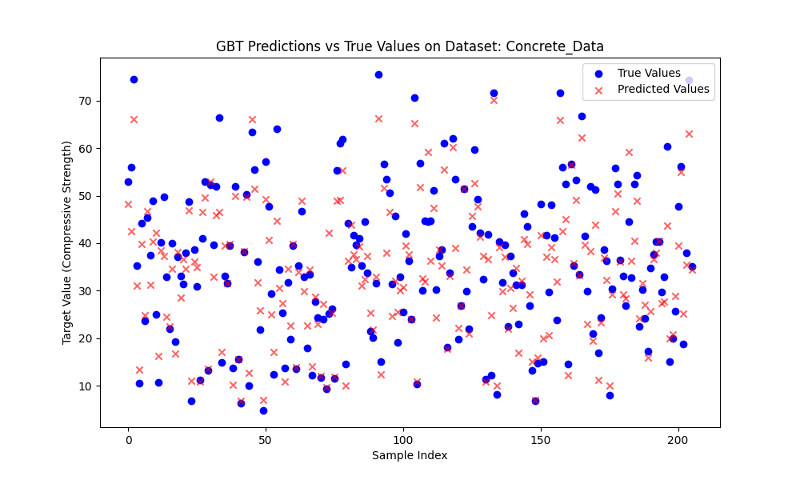
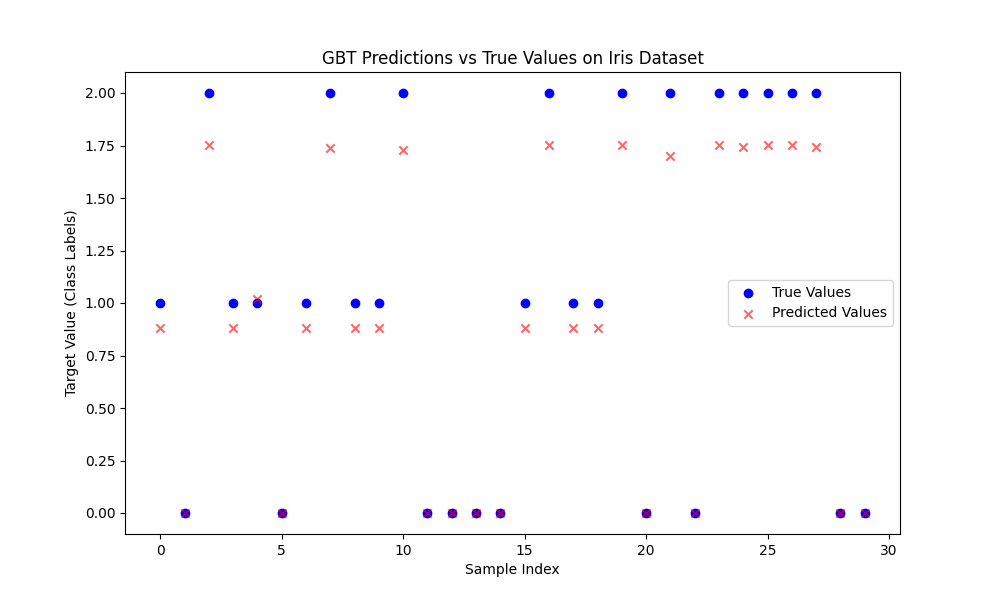

# Project 2

## Gradient Boosted Trees (GBT) Implementation and Application

## Team Members:

- **Aakash Shivanandappa Gowda**  
  A20548984
- **Dhyan Vasudeva Gowda**  
  A20592874
- **Hongi Jiang**  
  A20506636
- **Purnesh Shivarudrappa Vidhyadhara**  
  A20552125

## 1. Overview

This project implements a **Gradient Boosted Trees (GBT)** model from scratch for both classification and regression tasks. The model is designed to iteratively improve its predictions by correcting the residuals of previous iterations using regression trees. It provides a practical demonstration of

## 2. Key Components of the Project

### 1. Gradient Boosted Trees (GBT) Implementation

The core functionality of the project lies in the custom implementation of Gradient Boosted Trees:

- **`GBT` Class**:
  - Implements the Gradient Boosting algorithm for regression tasks.
  - Supports multiple decision trees as weak learners to iteratively improve the prediction accuracy.
  - Uses the residuals of the previous tree to train the next tree.
  - **Parameters**:
    - `num_estimators`: Number of boosting stages.
    - `max_depth`: Maximum depth of each regression tree.
    - `min_split`: Minimum samples required to split an internal node.
    - `learning_rate`: Step size for updating predictions.
    - `criterion`: Error metric used to evaluate the split (`mse` for regression tasks).

- **`RegressionTree` Class**:
  - Implements individual regression trees.
  - Recursively splits the data to minimize the residual error at each node.
  - Supports finding the best split based on minimizing mean squared error (MSE).
  - Leaf nodes return the average target value for regression.

### 3. Dataset Handling

The project includes handling two datasets:

- **Iris Dataset (Classification)**:
  - Built-in dataset from `sklearn.datasets`.
  - Used to classify flower species.
  - Model predictions are rounded to the nearest class labels.
  - Classification accuracy is calculated using `accuracy_score`.

- **Concrete Data Dataset (Regression)**:
  - Provided via an Excel file (`Concrete_Data.xls`).
  - Used to predict compressive strength based on features such as cement, water, and age.
  - Evaluation metrics include **Root Mean Squared Error (RMSE)** and **R² Score**.

### 4. Features of the Project

- **Training and Evaluation**:
  - Supports training GBT models on both classification and regression tasks.
  - Evaluates the model using relevant metrics (**accuracy**, **RMSE**, and **R²**).
  - Automatically splits data into training and testing sets using `train_test_split`.

- **Model Persistence**:
  - Models are saved as `.pkl` files using Python’s `pickle` module.
  - This allows for loading pre-trained models for future use without re-training.

- **Visualization**:
  - Uses `matplotlib` to visualize:
    - **Predictions vs. True Values**.
  - Helps assess model performance visually.

### 5. Main Functionalities

- **`train_and_save_model()`**:
  - Trains a GBT model on the Iris dataset.
  - Evaluates the model on the test set and saves the model as `gbt_iris_model.pkl`.
  - Generates a plot comparing predicted and true values.

- **`load_and_plot_model()`**:
  - Loads a pre-trained GBT model from disk.
  - Evaluates it on the test set and plots predictions against true values.

- **`train_concrete_model()`**:
  - Trains a GBT model on the Concrete dataset.
  - Evaluates the model using **RMSE** and **R²**.
  - Saves the model and generates a plot comparing predictions and true values.

- **Interactive Command-Line Menu**:
  - Provides users with the following options:
    1. Train and save the Iris model.
    2. Load the saved Iris model and visualize predictions.
    3. Train the default Concrete dataset model.
    4. Train a custom dataset model provided by the user.
    5. Quit the application.

### 6. Evaluation Metrics

- **Classification Tasks (Iris Dataset)**:
  - **Accuracy Score**: Measures the proportion of correctly classified samples.

- **Regression Tasks (Concrete Data)**:
  - **Root Mean Squared Error (RMSE)**: Measures the standard deviation of prediction errors.
  - **R² Score**: Indicates how well the model explains the variance in the target variable.

## 1. Boosting Trees

## Q1.What does the model you have implemented do and when should it be used?                                  #################

## Q2.How did you test your model to determine if it is working reasonably correctly?

## Q3.What parameters have you exposed to users of your implementation in order to tune performance? (Also perhaps provide some basic usage examples.)

## Q4.Are there specific inputs that your implementation has trouble with? Given more time, could you work around these or is it fundamental?

- ## Visualization

### **1.GBT Predictions vs True Values on Concrete Data**

### **Explanation of the Plot**

The plot was generated as part of the `train_concrete_model()` function in the Gradient Boosted Trees (GBT) implementation. It provides a comparison between the **true target values** (compressive strength of concrete) and the **predicted values** generated by the GBT model.

### **Key Features of the Plot**

1. **True Values (Blue Dots)**:
   - These represent the actual compressive strength values of the concrete samples in the test set.
   - Each dot corresponds to a true target value for a particular sample in the dataset.

2. **Predicted Values (Red Crosses)**:
   - These represent the model's predictions for the same samples.
   - The model predicts compressive strength based on the features (cement, water, age, etc.) in the test set.

3. **X-Axis (Sample Index)**:
   - Represents the index of each sample in the test set.
   - The samples are plotted in sequential order.

4. **Y-Axis (Target Value - Compressive Strength)**:
   - Represents the compressive strength values (both true and predicted).
   - Higher values indicate stronger concrete, while lower values indicate weaker concrete.

---

### **Interpretation of the Plot**

- The **blue dots (true values)** and **red crosses (predicted values)** are plotted for each sample to visually compare the GBT model's performance.
- **If the model performs well**, the red crosses should closely align with the blue dots, indicating that the model's predictions are accurate.

#### **Observations**:
- In some areas, the predicted values (red crosses) closely align with the true values (blue dots), showing that the model captures the trend for those samples.
- However, there are also several discrepancies where the predicted values deviate significantly from the true values, indicating that the model may struggle with certain samples.
- These deviations suggest that there is room for improvement, potentially through hyperparameter tuning, more advanced feature engineering, or trying alternative models.

---

### **Evaluation Metrics (RMSE and R² Score)**

The `train_concrete_model()` function calculates the following metrics:

1. **Root Mean Squared Error (RMSE)**:
   - Measures the average magnitude of the prediction error.
   - A lower RMSE indicates that the predicted values are closer to the true values.

2. **R² Score**:
   - Indicates how well the model explains the variance in the target variable.
   - A value close to 1 means the model explains most of the variance, while a value closer to 0 indicates poor explanatory power.

---

### **Conclusion**

This plot provides a visual representation of the GBT model's performance on the **Concrete Data** dataset. While the model captures some trends, the gaps between true and predicted values suggest potential areas for optimization. Further improvements could involve:
- Adjusting hyperparameters.
- Exploring more features.
- Trying alternative machine learning models.

---

### **2.GBT_Predictions_Iris**

### **Explanation of the Plot**

This plot, generated from the `train_and_save_model()` function in the above Gradient Boosted Trees (GBT) implementation, compares the **true class labels** and **predicted class labels** for the **Iris dataset**.

---

### **Key Features of the Plot**

1. **True Values (Blue Dots)**:
   - These represent the actual class labels (`0`, `1`, `2`) for the test samples.
   - Each blue dot corresponds to the true target class of a specific sample in the test set.

2. **Predicted Values (Red Crosses)**:
   - These are the predicted class labels from the GBT model.
   - Ideally, red crosses should align with blue dots if the model is highly accurate.

3. **X-Axis (Sample Index)**:
   - Represents the index of test samples.
   - Samples are plotted sequentially from `0` to the total number of test samples.

4. **Y-Axis (Target Value - Class Labels)**:
   - Represents the class labels for the Iris dataset:
     - `0` = Setosa
     - `1` = Versicolor
     - `2` = Virginica
   - The closer the red crosses (predicted values) are to the blue dots (true values), the better the model's performance.

---

### **Interpretation of the Plot**

- **Perfect Matches**:
  - In some areas, the red crosses perfectly overlap with the blue dots, indicating that the model correctly predicted the class for those samples.

- **Misclassifications**:
  - For some samples, the red crosses (predictions) do not align with the blue dots (true values), which shows that the model misclassified those samples.

---

### **Evaluation Metrics**

In this specific use case, the following evaluation metric is calculated:

- **Accuracy Score**:
  - Measures the proportion of correctly classified samples.
  - The closer the predicted values are to the true values, the higher the accuracy.

---

### **Conclusion**

This plot provides a visual representation of the GBT model's classification performance on the **Iris dataset**. While the model shows good performance for many samples, the discrepancies indicate areas for improvement, such as fine-tuning hyperparameters or trying alternative models.