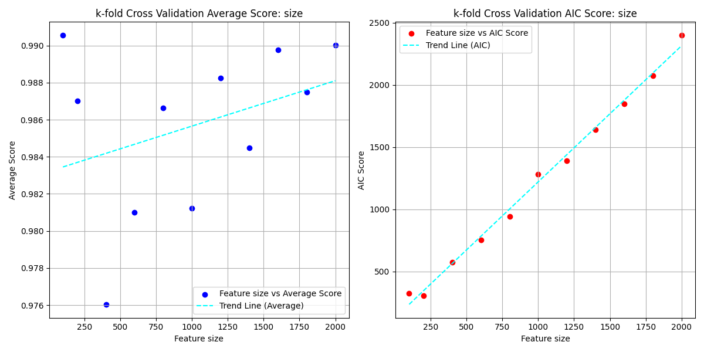
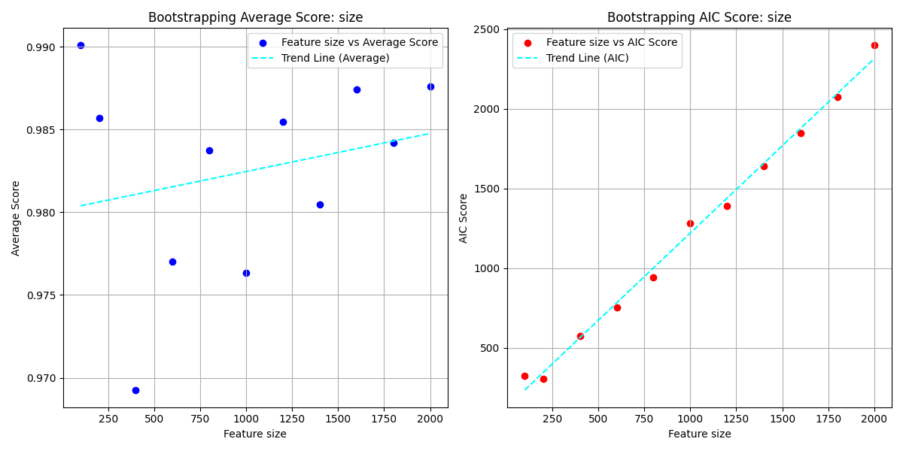
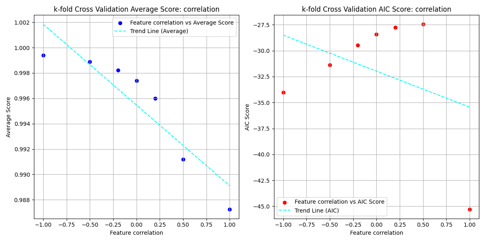
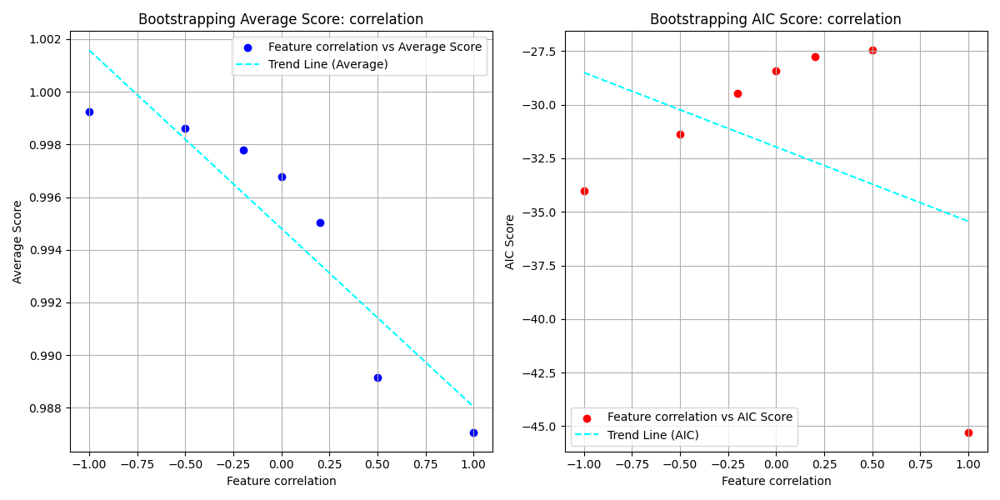
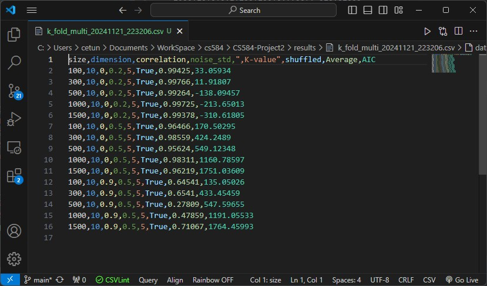
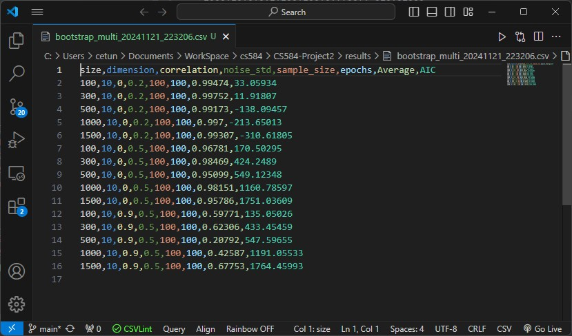
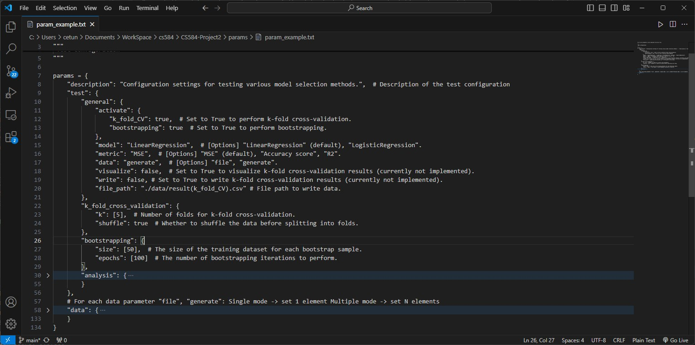
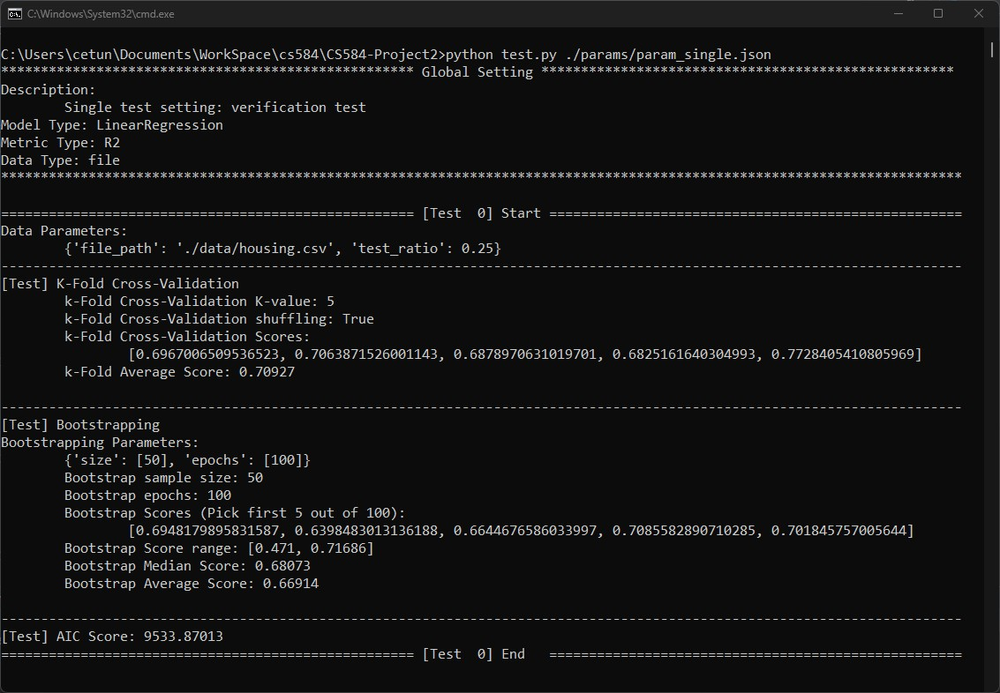
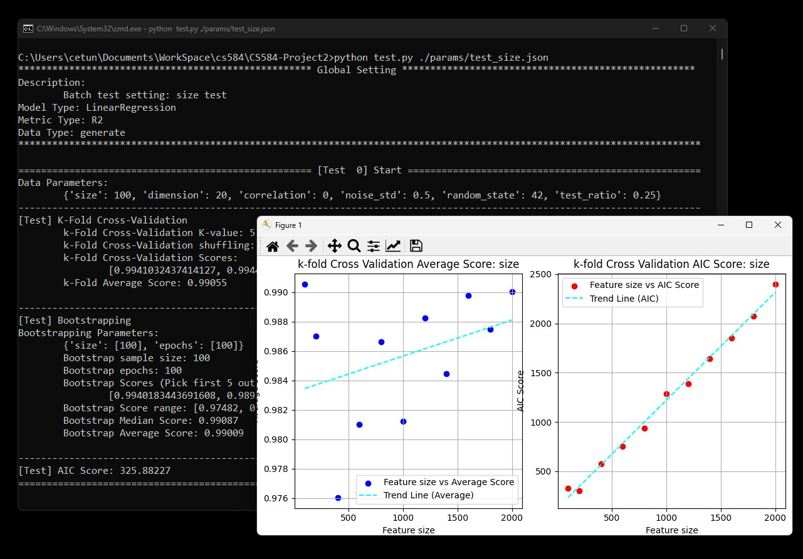

# Project 2

### Implemented model
* generic k-fold cross-validation and bootstrapping model selection methods.

### Creator Description
- Name: Haeun Suh
- HawkID: A20542585
- Class: CS584-04 Machine Learning(Instructor: Steve Avsec)
- Email: hsuh7@hawk.iit.edu
- 
#### [Question 1] Do your cross-validation and bootstrapping model selectors agree with a simpler model selector like AIC in simple cases (like linear regression)?
- For simple datasets, it was observed that cross-validation and bootstrapping models generally reach the same conclusions as simpler methods like AIC.
- However, on more complex datasets, particularly those with random elements or multi-collinearity, the results were somewhat inconsistent.
- Below is a comparison of the average metric scores from cross-validation and bootstrapping with AIC scores for the same tests.

##### Size test:
- Model: Simple Linear Regression
- Metrics: R^2
- [K-fold] k = 5, shuffling = Yes
- [bootstrapping]  sampling size: 100, epochs: 100
- [Configuration file] /params/test_size.json
 

 

- AIC tends to increase proportionally with the dataset size. However, the average metric scores for cross-validation and bootstrapping are relatively irregular, with gentler slopes in their trend lines, regardless of the dataset size.
- The k-value applied to the model may have contributed to an underestimation of the dataset size. As a result, these methods do not reach the same conclusions as AIC.

- Below is another test to evaluate the impact of correlation.

##### Correlation test:
- Model: Simple Linear Regression
- Metrics: R^2
- [K-fold] k = 5, shuffling = Yes
- [bootstrapping]  sampling size: 100, epochs: 100
- [Configuration file] params/test_correlation.json
 

 
- Under multi-collinearity, the trends for cross-validation and bootstrapping models were strong. However, AIC did not exhibit a similarly strong trend and showed artificially high performance under the assumption of a perfect correlation coefficient of 1.
- The two models developed do not yield the same conclusions as AIC. In fact, the conclusions were often contradictory (e.g., lower scores being better for AIC).
 
 
- In datasets with multi-collinearity or heavily biased structures, cross-validation and bootstrapping model selectors may not align with simpler model selectors like AIC.

#### [Question 2] In what cases might the methods you've written fail or give incorrect or undesirable results?

- According to the test results mentioned above, there is a high possibility of incorrect conclusions if the test data is too large, has multi-collinearity, or has a biased structure.
- In particular, according to the test results of testing multiple factors together as shown below, performance fluctuations were most severe when multi-collinearity existed.

##### Multi-factor test:
- Model: Simple Linear Regression
- Metrics: R^2
- [K-fold] k = 5, shuffling = Yes
- [bootstrapping]  sampling size: 100, epochs: 100
- [Configuration file] /params/test_multi.json
 

 
- When the data was predictable but noisy, the cross-validation and bootstrapping models performed better than AIC. However, in more complex scenarios, such as with multi-collinearity or data bias, both models exhibited unstable metric scores.
- Since both methods aim to equalize performance across folds or samples, they may not be appropriate indicators for model selection if the data distribution is highly unstable.
 
 
- In summary, if the data distribution is overly complex and biased, the two developed models may not be suitable for model selection.
 

#### [Question 3] What could you implement given more time to mitigate these cases or help users of your methods?
- To address these limitations, additional improvements could include:
> - Adding regularization techniques (e.g., Ridge, Lasso, ElasticNet) to handle multi-collinearity.
> - Implementing preprocessing methods, such as Principal Component Analysis (PCA), for datasets with high correlation coefficients.
> - Providing automated warnings or recommendations for datasets with bias, multi-collinearity, or extreme size imbalances.
 

#### [Question 4] What parameters have you exposed to your users in order to use your model selectors.
- For user convenience, all parameter settings, including data generation conditions, are included in:
> params/
- When running the mail script test.py, the user can specify the desired settings by selecting the json format settings file that exists in the location.
- Regarding parameter settings, specifications are provided in 'params/param_example.txt' and sample images are as follows.

 
- However, the parameters related to the actual model are limited and the specifications are as follows.
>> "test": {
        "general": {
            "model": "LinearRegression",  # [Options] "LinearRegression" (default), "LogisticRegression".
            "metric": "MSE"  # [Options] "MSE" (default), "Accuracy score", "R2".
        },
        "k_fold_cross_validation": {
            "k": [5],  # Number of folds for k-fold cross-validation.
            "shuffle": true  # Whether to shuffle the data before splitting into folds.
        },
        "bootstrapping": {
            "size": [50],  # The size of the training dataset for each bootstrap sample.
            "epochs": [100]  # The number of bootstrapping iterations to perform.
        }
}
- Regarding k-fold cross validation, the direct variables are as follows.
>>  - model: The statistical model to test.
>>  - metric: The metric function to measure the model's performance.
>>  - X: The feature matrix for training.
>>  - y: The target labels for training.
>>  - k: The number of folds to divide the data into.
>>  - shuffle: Whether to shuffle the data before splitting into folds.
 
- Regarding Bootstrapping model, the direct variables are as follows.
>> - model: The statistical model to test.
>>  - metric: The metric function to measure the model's performance.
>>  - X: The feature matrix for training.
>>  - y: The target labels for training.
>>  - s: The size of the training dataset for each bootstrap sample.
>>  - epochs: The number of bootstrap iterations to perform.

#### Additional Notes
Since the description of each function and execution is written in comments, only points to keep in mind when executing are explained in detail:
- You can refer to the guidelines in 'params/param_example.txt' or run one of several pre-written configuration files. 
  - The simplest and easiest to modify file is 'param_single.json'. Use this file to test and verify execution for the program.
- Visualization is only enabled for some items and is only supported for 'generate' type datasets, including file creation.
- Since the purpose of this task is to implement a model related to model selection, the learning model to be evaluated is a linear model from scikit-learn.
- The data folder contains files that you can simply experiment with running. The name, description, and source of each file are included in dataSource.txt.

#### Sample execution
* To directly execute only the implemented model, you can call the relevant function in modelSelection.py.
>> from modelSelection import k_fold_cross_validation, bootstrapping
1. Adjust configuration file. Refer to 'params/param_example.txt' to set up
   * Alternatively, you can choose one of the settings in the params folder. See param_list.csv for a brief introduction to those settings.
2. Execute 'test.py' at the prompt(at that script location) and run it by entering the path to the file. (The example used param_single.json.)
   * Sample code as below:
    >> python test.py ./params/param_single.json
   * Sample execution image as below:
    
     
3. (Optional) Another execution for size testing as batch job
   * Sample code as below:
    >>       python test.py ./params/test_size.json
   * Sample execution image as below:
    
   
    
   * Sample execution image as below:
    
   