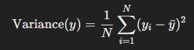

# Project 2 - Boosting Trees :
Implementing the gradient-boosting tree algorithm (with the usual fit-predict interface)

Submitted by The Boosted Bandits:
1. Anushka Sarath - A20576979 
2. B P Gayathri Ananya - A20588605
3. Gladys Gince Skariah - A20576603

All the team members collaborated equally to implement the project.

## 1. Introduction 

What does the model you have implemented do and when should it be used?

### 1.1 Model description:
#### Ensemble methods
When predicting a target variable with any machine learning method, we aim to minimize the primary sources of difference between actual and predicted values, which are noise, variance, and bias and *Ensemble methods* help reduce variance and bias.
An ensemble is essentially a collection of models that combine their predictions (e.g., by taking the mean) to produce a final output. The benefit of using ensembles is that multiple models focused on the same target variable tend to outperform any single predictor. Ensemble techniques are divided into *Bagging* and *Boosting*. 
In Boosting, predictors are built sequentially rather than independently. Boosting works by having each new predictor learn from the mistakes of the previous ones. As a result, observations with higher errors in earlier models are more likely to be emphasized in subsequent models, allowing the algorithm to better correct its errors. However, it’s important to carefully select a stopping criterion to avoid overfitting on the training data.
Gradient boosting is a boosting model technique for regression and classification problems. It produces a prediction model in the form of an ensemble of weak prediction models, typically *decision trees*.

#### Decision trees
A decision tree is a flowchart-like structure used to make decisions or predictions. It consists of nodes representing decisions or tests on attributes, branches representing the outcome of these decisions, and leaf nodes representing final outcomes or predictions. Each internal node corresponds to a test on an attribute, each branch corresponds to the result of the test, and each leaf node corresponds to a class label or a continuous value.
T
##### The process of creating a decision tree involves:
- Selecting the Best Attribute: Using a metric like Gini impurity, entropy, variance reduction or information gain, the best attribute to split the data is selected.
- Splitting the Dataset: The dataset is split into subsets based on the selected attribute.
- Repeating the Process: The process is repeated recursively for each subset, creating a new internal node or leaf node until a stopping criterion is met.

##### Metrics for splitting -
To decide which feature to be considered as the root node and which feature should be the next decision node and so on, information gain of each feature is used. The feature which has maximum information gain will be considered as the root node.

__Information gain for regression__: 
For regression, information gain is based on the reduction in variance. A split is preferred if it significantly reduces the variance, as this means the target values are more predictable.


where
- Variance(Parent): Variance of the target variable in the parent node.
- Variance(Child): Variance of the target variable in the ith child node
- N(i) and N: Number of samples in the ith child and parent, respectively

__Variance__:
To calulate the variance we are using numpy.var() function. It measures the spread of data around its mean. Its formula is:



where
- y(i) represents individual data points.
- yhat - mean of y
- N is the number of data points

__Information gain for classification__: 
For classification, information gain is calculated using entropy:


where
- H(Parent): Entropy of the parent node.
- H(Child): Entropy the ith child node

__Entropy__: Entropy is a measure of disorder or impurity in the given dataset. It is calculated as


where
p(X) is the number of times the class X has occured in that node divided by the total number of nodes

.jpg)

Entropy values can fall between 0 and 1. If all samples in data set, belong to one class, then entropy will equal zero. If half of the samples are classified as one class and the other half are in another class, entropy will be at its highest at 1. In order to select the *best feature* to split on and find the *optimal decision tree*, the *attribute with the smallest amount of entropy is used*.

#### Gradient Boosting
- Gradient Boosting is a machine learning algorithm that builds an ensemble of decision trees in a sequential manner. Each tree corrects the errors of its predecessors, and the model combines them to make predictions. It is particularly effective for regression and classification tasks by minimizing a chosen loss function.
- Decision trees, typically shallow (with limited depth), are used as weak learners in Gradient Boosting. These trees focus on learning patterns in the residuals/errors from previous iterations.
- Each tree improves upon the previous ones by focusing on the hardest-to-predict examples.
- The ensemble of trees produces strong predictions by combining their outputs.
- This iterative error-correction process allows Gradient Boosting to create a accurate predictive model.
- when to use gradient boosting
  * Nonlinear Relationships: It captures complex patterns and interactions between features.
  * Noisy or Medium-sized Datasets: Works well with moderately large datasets where interpretability is less of a concern.
  * Feature Importance: Gradient Boosting can provide insights into feature importance in the dataset.


### 1.2 Implementation

#### Class created: 
- __Node__ : This class represents a single node in the decision tree, used to define splits in the data or hold values for leaf nodes.
- __DecisionTree__ : This class implements a decision tree used in the gradient boosting algorithm to predict residuals at each stage.
- __GradientBoostingRegressor__  : This class implements a gradient boosting regressor for regression tasks, using a sequence of decision trees to fit residuals and improve predictions iteratively.

#### Functions created within the class Node

1. __init__
- Initialize a tree node with the necessary attributes for splitting or prediction.
- Parameters:
  - feature: The index of the feature used for splitting at this node.
  - threshold: The value used to split the data.
  - left, right: The child nodes of this node (left for data less than or equal to threshold, right for data greater than threshold).
  - value: The value stored at a leaf node (used if this node is a leaf).

2. __is_leaf_node()__
-  Returns True if the node is a leaf node, meaning it holds a value and does not have children.

#### Functions created within the class DecisionTree

1. __init__
- Initializes the required parameters
- Parameters:
  - min_samples_split: The minimum number of samples required to split a node.
  - max_depth: The maximum depth of the tree.
  - n_features: The number of features to consider when looking for the best split.

2. __fit()__
- its the decision tree to the input data by growing it based on the features and target labels.
- Parameters:
  - X: Feature matrix (2D array) where rows are samples and columns are features.
  - y: Target values (1D array).

3. __grow_tree()__
-  Recursively builds the decision tree, creating splits until stopping criteria are met.If the maximum depth is reached or if all labels are the same (pure node) or if the number of samples is less than the min_samples_split then the node becomes a leaf node and it's value is set to the most common label in y which is the mean of y
- Parameters:
  - X: Feature matrix of the current subset.
  - y: Target values of the current subset.
  - depth: Current depth of the tree.

4. __best_split()__
- Finds the optimal feature and threshold for splitting based on information gain.
- Parameters:
  - X: Feature matrix.
  - y: Target values.
  - feat_idxs: Indices of features to consider for splitting.
- Returns: split_idx (indices of the best feature) and split_threshold (float) for the best split.

5. __information_gain()__
- Calculates the reduction in variance for a potential split, helping choose the best split point.
- Parameters:
  - y: Target values.
  - X_column: Single feature column.
  - threshold: Value used to split the feature.

6. __split()__
- Splits data indices into left and right based on whether they meet a threshold.
- `left_idxs`: Indices of samples where the features value <=threshold
- `right_idxs`: Indices of samples where the feature value > threshold.
- Parameters:
  - X_column:  A column of feature values.
  - threshold:  Threshold value for splitting.
- Returns: left_idxs and right_idxs  of indices.


7. __most_common_label()__
- Returns the mean value of labels, used to predict in regression tasks.
- Parameters:
  - y: Target labels at a leaf node.
- Returns: Mean value of y.

8. __predict()__
- Predicts target values for each sample in the input data.
- Parameters:
  - X: Feature matrix of samples to predict.
- Returns: Array of predictions.

9. __traverse_tree()__
- Traverses the tree to generate a prediction for a single sample.
- Parameters:
  - x:  Single data sample.
  - node: Current node in the tree traversal.
- Returns: Predicted value at a leaf node.

#### Functions used in GradientBoostingRegressor 

1. __init()__
Initializes required Parameters
- n_estimators: (int, default=100) Number of decision trees in the model.
- learning_rate: (float, default=0.1) Shrinks the contribution of each tree.
- max_depth: (int, default=3) Maximum depth of each decision tree.
- min_samples_split: (int, default=2) Minimum samples required to split a node

2. __fit()__
- Trains the gradient boosting model by iteratively fitting trees on residuals to minimize errors.
- Parameters:
  - X: (ndarray) Feature data for training.
  - y: (ndarray) Target labels for training.
- Returns: None.

3. __predit()__
- Predicts target values for each sample in the input data by combining predictions from all trees.
- Parameters:
  - X: (ndarray) Input data for which predictions are needed.
- Returns: Array of predicted values.

#### Model evaluation parameters

1. __MSE__ : 
Measures the average squared difference between predicted and actual values. It is given by the formula:


where y(i) is the actual value, y(i) hat is the predicted value and n is the number of observations.

2. __R2 square__: 
- Indicates the proportion of the variance in the dependent variable that is predictable from the independent variables.
- R² values range from 0 to 1, with values closer to 1 meaning that the model explains a large proportion of the variance in the data. An R² of 0 means the model explains none of the variance, while an R² of 1 means it explains all the variance.
- It is given by the formula


where y(i) is the actual value, y(i) hat is the predicted value and y bar is the mean of observations.

## 1.3 Steps to run the code

### Activating the Virtual Environment

1. **For Windows**:
   - Navigate to the directory where the virtual environment is located:
     ```bash
     cd /path/to/your/project
     ```
   - Activate the virtual environment:
     ```bash
     .\ml_env\Scripts\activate
     ```
2. **For macOS/Linux**:
   - Navigate to the directory where the virtual environment is located:
     ```bash
     cd /path/to/your/project
     ```
   - Activate the virtual environment:
     ```bash
     source ml_env/bin/activate
     ```
Once the environment is activated, you can proceed to install the necessary dependencies and run the scripts.

### Running the Test Files

* **To test using theLaptop Prices dataset:**
   ```bash
   python -m tests.test_gradient_boosting_laptops

* **To test using the Netflix Stock Prediction dataset:**
  ```bash
   python -m tests.test_netflix_regressor

* **To test using the Random dataset:**
  ```bash
   python -m tests.test_random_regression

## 2. Testing
How did you test your model to determine if it is working reasonably correctly?

### 2.1 Test case 0: 
Validating all the input variables to see if they have the expected values before we fit the model.

1. min_samples_split must be at least 2:


2. max_depth must be a positive integer.


3. X and y must be NumPy arrays.


__Errors for GradientBoostingRegressor__

4. n_estimators must be a positive integer.


5. learning_rate must be in the range (0, 1).


6. max_depth must be a positive integer.


7. X and y must have the same number of samples.


8.  min_samples_split must be at least 2.


### 2.2 Test case 1:
__test_random_regression.csv__
1. Dataset Overview: A synthetic regression dataset is generated with features and a linear relationship to the target variable, making it ideal for testing the performance of regression models under controlled conditions. The dataset consists of:
  - Number of Samples: 500
  - Number of Features: 5
  - Noise: Gaussian noise added to the target variable for realism.
2. Feature Engineering and Data Generation: The feature matrix (X) is randomly generated, and the target variable (y) is computed as a linear combination of features plus noise:
  - Coefficients are randomly generated to define the relationship between features and target.
  - Gaussian noise (noise=0.1) is added to simulate variability in real-world data.
3. Training the Gradient Boosting Regressor: The custom GradientBoostingRegressor is trained on the synthetic dataset. Key hyperparameters include:
4. Parameters set:
  - n_estimators: 50
  - learning_rate: 0.1
  - max_depth: 3
Evaluating Model Performance:
The model's performance evaluation:


### 2.3 Test case 2:
__laptop_prices.csv__
1. Dataset Overview: The laptop price dataset includes features such as screen size (Inches), RAM, weight, CPU frequency, and storage capacities (PrimaryStorage and SecondaryStorage). The goal is to predict the laptop's price (in euros) using these attributes.
2. Feature Engineering and Data Preprocessing: The dataset uses six key features:
  - Inches: Screen size in inches.
  - Ram: RAM size in GB.
  - Weight: Laptop weight in kilograms.
  - CPU_freq: CPU frequency in GHz.
  - PrimaryStorage: Size of primary storage in GB.
  - SecondaryStorage: Size of secondary storage in GB.
  - The target variable is Price_euros.
  - Features and target values are split into training and testing sets using an 80-20 ratio.
3. Training the Gradient Boosting Regressor: The custom GradientBoostingRegressor is trained to predict laptop prices. The model parameters include:
4. The trained model performance evaluation:


5. Key Parameters:
  - Number of Estimators (n_estimators): 50
  - Learning Rate: 0.1
  - Max Depth: 3

6. plot comparing the actual and predicted values:


### 2.4 Test case 3:
__netflix.csv__

1. Dataset Overview: The Netflix dataset includes stock-related features such as Open, High, Low, and Close prices. The goal is to predict the next day's Close price based on these features.
2. Feature Engineering and Data Preprocessing: The dataset undergoes preprocessing steps, including handling missing values by dropping rows with NaN. The input features (X) are Open, High, and Low, while the target variable (y) is Close.
3. Training the Gradient Boosting Regressor: A custom GradientBoostingRegressor implementation is used for training. The model learns sequentially to reduce prediction errors using decision trees as base learners.
4. Evaluating Model Performance:
The model's performance evaluation:


Results are computed for the test set and compared against the ground truth values.
5. Key Parameters:
Number of Estimators (n_estimators): 75
Learning Rate: 0.2
Max Depth: 3
Minimum Samples Split: 2

6. The accuracy acheived with these parameter values for the dataset:


## 3. Parameters to tune performance:
What parameters have you exposed to users of your implementation in order to tune performance? (Also perhaps provide some basic usage examples.)

The parameters available for the users which they can use to tune the performance are

- n_estimators - default value set to 
- learning rate - default value set to 0.1
- max_depth - default value set to 3
- min_samples_split - default value set to 2

## 4. Future scope
Are there specific inputs that your implementation has trouble with? Given more time, could you work around these or is it fundamental?

- __Optimization for Faster Execution__:
Given more time, efforts could focus on optimizing the current implementation to reduce runtime. By optimizing algorithm parameters and employing efficient data structures, the model's training time can be minimized, making it more suitable for real-world applications where fast performance is crucial.
- __Versatile Model Design for Regression and Classification__:
Developing the algorithm as a flexible class that accommodates both regression and classification tasks would significantly enhance its versatility. This approach would allow the model to adapt to various problem types with minimal adjustments, making it a more robust and reusable tool.
- __Enhanced Data Cleaning and Preprocessing__:
With more resources allocated to data cleaning and feature engineering, the quality of input data can be improved, which would likely yield better model performance. This process might include handling outliers, refining feature selection, and scaling features effectively, leading to more accurate and reliable predictions.
